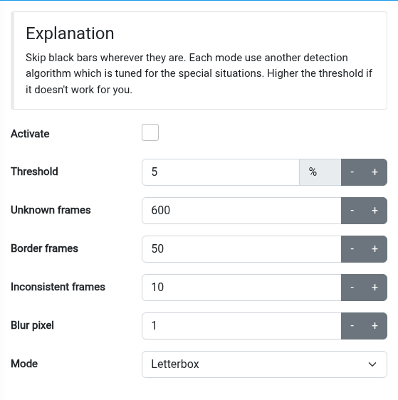
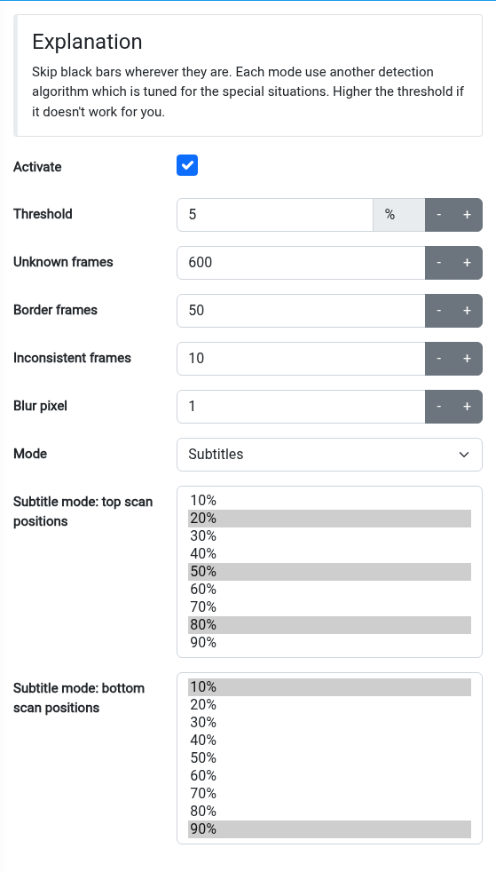

# Blackbar detector regression tests

Build and run with the Qt Core development package, without TV hardware:

```sh
cmake -S tests/blackborder -B build/blackborder-tests -DCMAKE_BUILD_TYPE=Release
cmake --build build/blackborder-tests
ctest --test-dir build/blackborder-tests --output-on-failure
```

The tests use HyperHDR's actual detector and image classes. Synthetic frames
reproduce [issue #821](https://github.com/awawa-dev/HyperHDR/issues/821), including
wide two-line captions that cross Letterbox mode's fixed bottom scan positions.
They also cover configurable top/bottom samples, invalid or empty selections,
asymmetric bars, aspect-ratio changes, threshold boundaries, completely black
frames, bright picture content, and small or empty images.

In **Image processing → Blackbar detector**, enable detection and select
**Subtitles**. The bottom scans default to 10% and 90% of the image width; select
different positions if your captions overlap those samples. The mode detects
top/bottom bars only. Subtitles inside the active picture are still included in
LED color sampling. Existing modes and their default selection are unchanged.

These fixtures validate the algorithm, not real-world capture performance or
subtitle coverage across different players. TV playback remains a manual check.

## Web UI

Existing Letterbox mode:



Subtitles mode with custom top scan positions:


